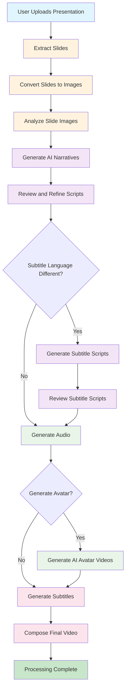
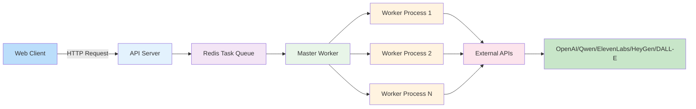
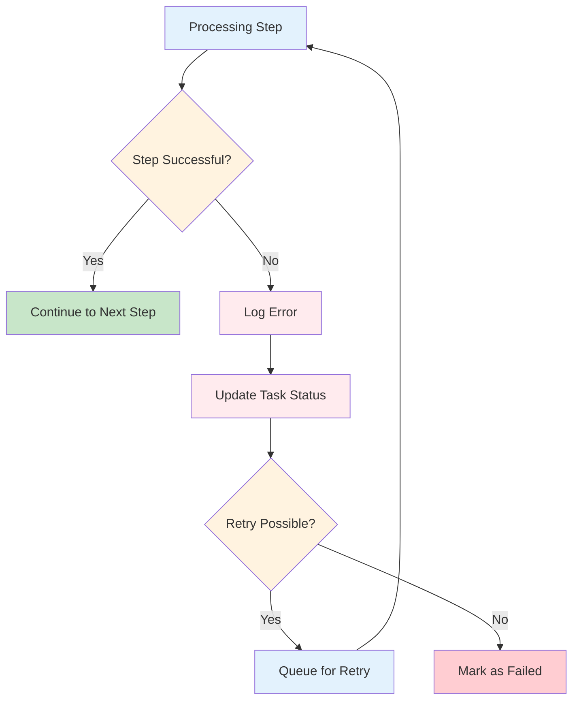
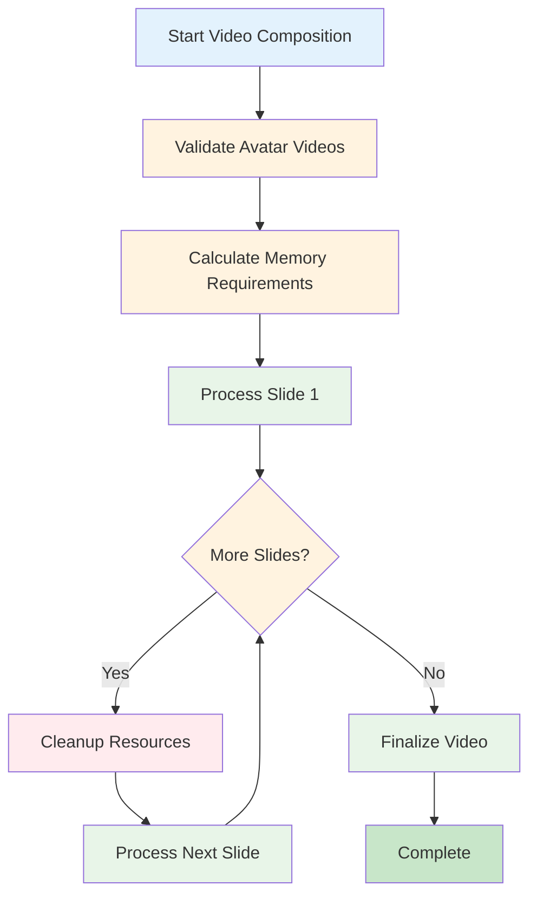
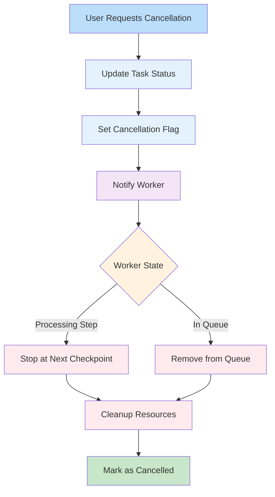

# Pipeline Diagrams

## Overview

SlideSpeaker processes presentations through a series of well-defined steps, each responsible for a specific aspect of transforming slides into an engaging video presentation. The pipeline is designed to be resilient, allowing processing to resume from the last completed step in case of failures.

## Complete Processing Pipeline

## Detailed Step-by-Step Pipeline

### 1. Extract Slides
Extracts content from PDF or PowerPoint presentations.
- Input: Original presentation file
- Output: Structured slide data with text content

### 2. Convert Slides to Images
Converts each slide to high-quality image format for processing.
- Input: Structured slide data
- Output: Image files for each slide

### 3. Analyze Slide Images
Uses AI to analyze visual content in slides.
- Input: Slide images
- Output: Visual content descriptions and metadata

### 4. Generate AI Narratives
Creates AI-generated scripts for each slide.
- Input: Slide content and visual analysis
- Output: Narration scripts in selected language

### 5. Review and Refine Scripts
Reviews and refines scripts for consistency and quality.
- Input: Initial narration scripts
- Output: Polished narration scripts

### 6. Generate Subtitle Scripts (Conditional)
Creates scripts for subtitles when subtitle language differs from audio language.
- Input: Slide content and visual analysis
- Output: Subtitle scripts in selected language

### 7. Review Subtitle Scripts (Conditional)
Reviews and refines subtitle scripts for consistency.
- Input: Initial subtitle scripts
- Output: Polished subtitle scripts

### 8. Generate Audio
Synthesizes voice audio from narration scripts.
- Input: Polished narration scripts
- Output: Audio files for each slide

### 9. Generate AI Avatar Videos (Conditional)
Creates AI avatar videos synchronized with audio.
- Input: Audio files
- Output: Avatar video clips for each slide

### 10. Generate Subtitles
Creates subtitle files in selected language.
- Input: Script content
- Output: SRT and VTT subtitle files

### 11. Compose Final Video
Combines all elements into the final presentation video.
- Input: Slide images, audio files, avatar videos, subtitles
- Output: Complete presentation video

## Task Processing Architecture

## Error Handling and Recovery

## Service Configuration Options

The pipeline now supports multiple AI service providers, allowing users to mix and match based on their preferences and API key availability:

### Script Generation Services
- **OpenAI**: GPT models for high-quality script generation
- **Qwen**: Alibaba's Qwen model, particularly effective for Chinese content

### Text-to-Speech Services  
- **OpenAI TTS**: Uses the same OpenAI API key for voice synthesis
- **ElevenLabs**: Premium voices with high quality
- **Local TTS**: Fallback option using local text-to-speech engines

### Avatar Generation Services
- **HeyGen**: Realistic AI presenters with natural movements
- **DALL-E**: Custom AI-generated avatars using OpenAI's image generation

## Memory-Optimized Video Composition

## Cancellation Flow

